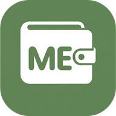

<p align="center">
  
</p>

<h1 align="center">MonthExpense</h1>

<p align="center">
  <strong>Open-Source, Local-First Personal Expense Logger & Receipt Scanner</strong><br>
  Built on <em>Cloudflare Workers</em>, <em>Hono</em>, <em>React 19</em>, and <em>Google Sheets Sync</em>.
</p>

<p align="center">
  <a href="#license"></a>
  <a href="https://workers.cloudflare.com/"></a>
  <a href="https://hono.dev/"></a>
  <a href="https://react.dev/"></a>
  <a href="https://bun.sh/"></a>
</p>

---

## 🌟 What is MonthExpense?

**MonthExpense** is a mobile-first, privacy-respecting, open-source personal finance application. It replaces closed, ad-filled, subscription-gated expense tracker apps with a tool you completely own and control.

Your data is stored **locally on your device** (local-first) and syncs directly to your own **private Google Spreadsheet** in Google Drive. There is **no proprietary database**, **no vendor lock-in**, and **zero tracking**.

### ✨ Key Features

- 📸 **Smart In-Browser Receipt Scanner**: Capture physical receipts on mobile or web. Runs local client-side OCR ([PaddleOCR-JS](https://github.com/flyinox/PaddleOCR-JS) WebAssembly) and extracts items, merchant, tax, date, and category using edge AI ([Cloudflare Workers AI](https://developers.cloudflare.com/workers-ai/) with Meta Llama 3.1 8B Instruct).
- 🎙️ **Voice Expense Logging**: Speak your daily expenses naturally (e.g., _"Bought coffee for 18 dollars from Main Wallet"_ or _"Groceries for 45 dollars paid with debit card"_). Transcribed using Web Speech API or in-browser Whisper WASM and structured with LLM parsing.
- 💳 **Multi-Wallet Management**: Group expenses into custom wallets (Cash, Bank, E-Wallets) with playful animal avatars and monthly spending cards.
- 📅 **Recurring Bills & Debt Tracking**: Track loan/debt repayments with expected due dates and reminder indicators on your calendar. Once marked paid/settled, debts are automatically excluded from your real monthly spending totals both in the app and your Google Sheet.
- 📊 **Interactive Analytics & Spending Trends**: View 5-day period spending trends, category distributions, daily averages, and peak expense days.
- 📈 **Zero-Lock-In Google Sheets Sync**: Connects directly to Google Sheets using Google Identity Services (GIS). All transactions, wallets, and interactive charts are preserved in your personal spreadsheet.
- 📱 **Installable Progressive Web App (PWA)**: Fast, responsive, offline-capable, and installable on iOS, Android, and desktop.
- ⚡ **Single Unified Fullstack Architecture**: React frontend and Hono backend worker build into a single, cohesive Cloudflare Workers deployment with Workers Static Assets.

---

## 🚀 Open Source & Self-Hostable

MonthExpense is **100% free and open-source under the MIT License**.

You can deploy and self-host your own private instance on Cloudflare Workers for **$0/month** within Cloudflare's generous free tier:

- Cloudflare Workers: 100,000 free requests/day
- Cloudflare Workers AI: Free daily neuron allocation
- Cloudflare Workers Static Assets: Unlimited bandwidth for frontend assets
- Google Sheets API: Free personal quota

---

## 🏗️ Architecture

```text
monthexpense/
├── src/
│   ├── app/                # Root React application & global layout
│   ├── components/         # UI components (home, transactions, analytics, camera, modals)
│   ├── features/           # Domain logic (expense, receipt, sync, voice, wallet)
│   ├── lib/                # API client (Hono RPC hc<AppType>), image processing, utils
│   └── worker/             # Embedded fullstack Hono API running on Cloudflare Workers
│       ├── ai/             # Workers AI bindings & prompt templates (Llama 3.1)
│       ├── controllers/    # API endpoints (/v1/receipts, /v1/expenses, /v1/voice, /v1/sheets)
│       ├── middleware/     # Auth, identity quota, rate limiting, request ID
│       ├── schemas/        # Zod validation schemas
│       ├── types/          # Worker env bindings & context types
│       └── index.ts        # Hono router entrypoint & AppType export
├── public/                 # Static assets, PWA icons, manifest, and headers
├── scripts/                # Utility scripts (icon generation, quick tunnel, mint secret)
├── test/
│   └── worker/             # Vitest tests executed in Miniflare / workerd runtime
├── vite.config.ts          # Unified Vite config with @cloudflare/vite-plugin
├── vitest.config.ts        # Vitest worker pool configuration
└── wrangler.jsonc          # Unified Cloudflare Worker configuration (worker + assets)
```

---

## 🛠️ Step-by-Step Self-Hosting & Deployment Guide

Follow this guide to deploy your own instance of MonthExpense to Cloudflare Workers.

### 1. Prerequisites

- [Bun](https://bun.sh/) (v1.2+) installed on your machine
- A [Cloudflare Account](https://dash.cloudflare.com/)
- A [Google Cloud Console](https://console.cloud.google.com/) account (to enable Google Sheets sync)
- An [Upstash Redis](https://upstash.com/) account (Optional, recommended for rate-limiting and identity locking)

### 2. Clone the Repository & Install Dependencies

```bash
git clone https://github.com/zeetec20/monthexpense.git
cd monthexpense
bun install
```

### 3. Setup Google Cloud OAuth (for Google Sheets Sync)

1. Open [Google Cloud Console](https://console.cloud.google.com/).
2. Create a new project (e.g., `MonthExpense`).
3. Navigate to **APIs & Services > Library** and enable:
   - **Google Drive API**
   - **Google Sheets API**
4. Configure the **OAuth Consent Screen**:
   - User Type: **External**
   - App Name: `MonthExpense`
   - Scopes: `.../auth/drive.file` and `.../auth/spreadsheets`
5. Go to **APIs & Services > Credentials** and click **Create Credentials > OAuth Client ID**:
   - Application Type: **Web application**
   - Name: `MonthExpense Web Client`
   - **Authorized JavaScript origins**:
     - `http://localhost:5173` (for local development)
     - `https://<your-worker-subdomain>.workers.dev` (or your custom domain)
   - Copy the generated **Client ID**.

### 4. Configure Environment & Secrets

#### A. Local Development Configuration

Copy `.env.example` to `.env`:

```bash
cp .env.example .env
```

Open `.env` and configure your environment:

```env
# Shared API Secret (automatically feeds both Worker backend and frontend client)
API_KEY=your-secure-api-key

# Google OAuth Web Client ID (from Step 3 above)
VITE_GOOGLE_CLIENT_ID=your-google-client-id.apps.googleusercontent.com

# HMAC Secrets for Sheets Identity & Quotas (optional in dev)
REGULAR_API_KEY=your-regular-tier-secret
PREMIUM_API_KEY=your-premium-tier-secret

# Upstash Redis credentials (optional in dev)
UPSTASH_REDIS_REST_URL=https://your-upstash-redis-url.upstash.io
UPSTASH_REDIS_REST_TOKEN=your-upstash-token
```

> [!NOTE]
> Vite automatically generates and synchronizes `.dev.vars` from `.env` whenever you start the dev server (`bun run dev`). You only ever need to edit `.env`!

#### B. Cloudflare Production Secrets

Authenticate Wrangler with your Cloudflare account:

```bash
bunx wrangler login
```

Set your production secrets in Cloudflare Workers:

```bash
bunx wrangler secret put API_KEY
bunx wrangler secret put REGULAR_API_KEY
bunx wrangler secret put PREMIUM_API_KEY
bunx wrangler secret put UPSTASH_REDIS_REST_URL
bunx wrangler secret put UPSTASH_REDIS_REST_TOKEN
```

### 5. Build & Deploy to Cloudflare Workers

Build the production bundle (compiles TypeScript, Vite frontend assets, and worker bundle):

```bash
bun run build
```

Verify your deployment package locally without publishing:

```bash
bun run deploy:dry-run
```

Deploy atomically to Cloudflare Workers:

```bash
bun run deploy
```

Your app is now live at `https://monthexpense.<your-subdomain>.workers.dev`!

### 6. (Optional) Custom Domain

To link your custom domain (e.g., `expense.yourdomain.com`):

1. Go to **Cloudflare Dashboard > Workers & Pages > monthexpense > Settings > Domains & Routes**.
2. Click **Add > Custom Domain** and enter your desired subdomain.
3. Don't forget to add your custom domain to **Authorized JavaScript origins** in Google Cloud Console!

---

## 💻 Local Development & Mobile Testing

### Start Dev Server

Run the unified Vite development server (serving both React client and Hono backend locally):

```bash
bun run dev
```

Open `http://localhost:5173` in your browser.

### Test on Mobile with Cloudflare Quick Tunnel

To test camera scanning and microphone permissions on a real mobile device, run the built-in tunnel:

```bash
bun run tunnel
```

This launches the development server and establishes a secure `https://*.trycloudflare.com` tunnel. Scan the printed QR code with your phone to test the app on mobile instantly.

---

## 🧪 Testing & Verification

MonthExpense includes automated unit and integration tests:

```bash
# Run all tests (client tests + worker tests)
bun run test

# Run worker tests in workerd / Miniflare runtime
bun run test:worker

# Run frontend client tests
bun run test:client

# Typecheck all modules (Client, Worker, Configs)
bun run typecheck

# Lint & code style checks
bun run lint
bun run format:check
```

---

## 📊 Google Spreadsheet Structure

When you link MonthExpense to Google Sheets, it provisions a private spreadsheet named **"Month Expense"** containing 3 tabs:

1. **`Transactions`**: Chronological log of all transactions (ID, Date, Wallet, Title, Amount, Currency, Source, Note, Merchant, Items, Month, Created At, Category, Detail, Schedule Type, Status).
2. **`Config`**: Wallet mapping (ID, Name) and encrypted sync identity.
3. **`Stats`**: Interactive financial dashboard including:
   - **Total Expense**: Automatically excludes settled debts so reimbursed money does not inflate spending.
   - **Daily Average**: Real daily spend average.
   - **Spending Trends**: Dynamic 5-day interval spending trend.
   - **Category Distribution**: Breakdown and charts by expense category.
   - **Spend by Wallet**: Aggregated spend across individual wallets.
   - **Spend by Month**: Month-over-month history.

---

## 📄 License

MonthExpense is licensed under the [MIT License](LICENSE). You are free to use, modify, distribute, and self-host this software.
